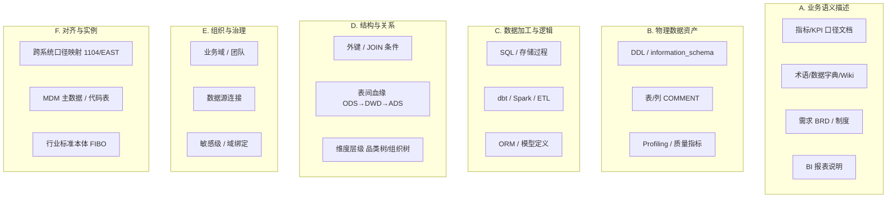
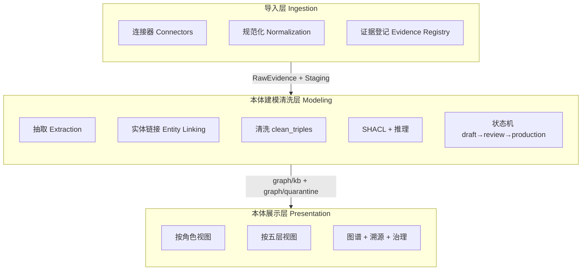
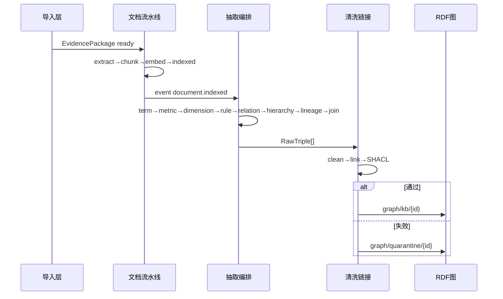
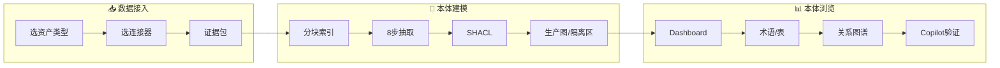

# 本体三层架构与 UI 优化方案

> 本文档汇总 2026-05 关于「企业数据统一整理、本体建模清洗、导入/展示层 redesign」的讨论结论。  
> **关联文档：** [ONTOLOGY_ENTERPRISE_DATA_SOURCES](./ONTOLOGY_ENTERPRISE_DATA_SOURCES.md)、[ONTOLOGY_REFACTOR_PLAN](./ONTOLOGY_REFACTOR_PLAN.md)、[DATALENS_OVERVIEW](./DATALENS_OVERVIEW.md)

**状态说明：** 🔲 规划中 / 🚧 部分已有基础 / ✅ 已实现

**实施进度（2026-05-26）：** 本文档 **P0–P3 已全部落地**；§7 对照表除 §9 能力边界外均为 ✅。剩余待办见 **§11 待办清单**。

---

## 1. 背景与问题

### 1.1 现状

当前知识库「导入」按 **接入通道** 分类（文件 / 官方 API / Git / 数据库），而本体清洗按 **语义角色** 分类（术语、指标、物理表、血缘等）。两套分类轴不一致，导致：

- 用户不清楚「导进来会变成术语还是血缘」；
- `KnowledgeEntry`、`Document`、`TableMeta` 等多处落点，缺少统一的「证据」抽象；
- 本体工作台、知识库详情、`/ontology/[layerKey]` 多入口，认知负担大。

### 1.2 目标

1. **统一整理企业数据** — 按语义资产类型归类，而非按文件/API/Git 归类；
2. **本体驱动清洗** — 唯一写入 production RDF 的路径：`抽取 → 链接 → SHACL → 晋升`；
3. **分层 UI** — 导入层（证据）、清洗层（建模流水线）、展示层（业务视图）。

### 1.3 设计原则（与现有架构一致）

| 原则 | 说明 |
|------|------|
| RDF 为真相源 | `graph/kb/{id}` 为 ABox SSOT，PostgreSQL 为缓存/检索 |
| TBox / ABox 分离 | 模式在 `ontology/tbox/`，实例在知识库图 |
| SHACL 守门 | 通过 → production；失败 → `graph/quarantine/{id}` |
| 采集通道 ≠ 语义分类 | 文件/Notion/Git 只是 **连接器**，顶层按企业数据语义分 |

---

## 2. 企业中常见的数据类型

按 **语义角色** 归纳（与接入渠道无关）：



| 类别 | 典型载体 | 在企业里的作用 |
|------|----------|----------------|
| **A. 业务语义描述** | Word/PDF/飞书/Confluence/制度 | 定义「叫什么、算什么、什么意思」 |
| **B. 物理数据资产** | 各库元数据、数据目录 | 定义「数据在哪、长什么样」 |
| **C. 数据加工逻辑** | Git 内 SQL/dbt/Python | 定义「怎么算出来、从哪张表来」 |
| **D. 结构与关系** | ER 图、JOIN 文档、血缘平台 | 定义「表怎么连、数据怎么流」 |
| **E. 组织与治理** | 域划分、Owner、数据源配置 | 定义「谁管、属哪个域」 |
| **F. 对齐与实例** | 监管映射表、MDM、枚举字典 | 定义「跨系统是否同一概念」 |

**隐性本体：** 外键→对象属性、CHECK→值域、聚合 SQL→指标公式、枚举注释→枚举类 — 多藏在 B/C/D 中，需抽取而非从零建模。

---

## 3. 企业数据 → 本体模块映射

### 3.1 TBox 类与清洗五层

本体 TBox 见 `backend/ontology/tbox/core.ttl`；清洗五层见 [ONTOLOGY_REFACTOR_PLAN](./ONTOLOGY_REFACTOR_PLAN.md#本体清洗五层模型)。

| 企业数据 | 本体模块（OWL 类 / 属性） | 清洗层 | 抽取器 / 来源 |
|---------|---------------------------|--------|---------------|
| 术语、字段释义、同义词 | `dl:BusinessTerm` | 词汇层 | `term_extractor` |
| KPI、口径、计算公式 | `dl:Metric` | 规则层 | `metric_extractor` |
| 分析维度、下钻层级 | `dl:Dimension` | 实体/概念层 | `dimension_extractor` |
| 校验/派生/风控规则 | `dl:BusinessRule` | 规则层 | `rule_extractor` |
| 概念上下位、产品树 | `skos:broader` / `skos:narrower` | 实体/概念层 | `hierarchy_builder` |
| 概念依赖、指标派生 | `dl:dependsOn`、`dl:derivedFrom`、`skos:related` | 关系层 | `relation_extractor` |
| 库表、列、COMMENT | `dl:PhysicalTable` / `dl:PhysicalColumn` | 数据资产 + 属性层 | 表分析 + `ontology_population`；建 DS 时 `metadata_ingest` |
| 数据源实例 | `dl:DataSource` | 治理 | `/api/datasources` |
| 表间 JOIN | `dl:JoinRelation`、`dl:joinableWith` | 关系层 | `join_extractor`、代码 JOIN 模式 |
| ETL/SQL 表级血缘 | `dl:LineageAssertion`、`dl:transformsFrom` | 关系层 | `lineage_extractor`（Git） |
| 原始材料 | `dl:Document` / `dl:DocumentChunk` | 证据层 | 文档流水线；`dl:groundedBy` 溯源 |
| 跨域/监管对齐 | `skos:exactMatch` / `skos:closeMatch` | 企业层 | `enterprise.ttl`；多需人工或 TTL 导入 |
| 组织/业务域 | `dl:BusinessDomain`、`dl:Organization` | 企业层 | 业务域 UI |
| SHACL 失败项 | `dl:QuarantinedAssertion` | 隔离区 | `clean_triples` → quarantine |

**术语 vs 指标：**

- **BusinessTerm** — 「叫什么、指什么」（词汇层）
- **Metric** — 「怎么算、口径是什么」（规则层，需 `formula` + `caliber`）

### 3.2 当前采集通道 → 语义类型（对照表）

| 采集通道（现状 UI） | 承载的企业数据 | 清洗后主要进入 |
|--------------------|----------------|---------------|
| 文件 / Notion / Confluence / 飞书 | A 类 业务语义 | Term / Metric / Dimension / Rule / Relation / Hierarchy |
| Git 仓库 | C 类 加工逻辑 + 部分 A 类 | Lineage、Join、`mapsToColumn`；少量 Term |
| 数据源 + 表分析 | B 类 物理资产 | PhysicalTable/Column |
| 知识库「数据库导入」 | B 类 引用 | 关联已有 TableMeta，不重复采集 Schema |
| 手动条目 | 任意（质量参差） | 同文档流水线 → 抽取 |
| TTL 本体导入 | 已结构化 RDF | `POST .../ontology/knowledge-bases/{id}/import` |

### 3.3 建议的统一产品分类（四类语义资产 + 治理）

| 统一分类 | 包含的企业数据 | 本体落点 | 服务的 Copilot 能力 |
|---------|---------------|----------|---------------------|
| **1. 业务语义** | 术语、指标、维度、规则、概念层级 | `BusinessConcept` 子类 + SKOS | 术语对齐、口径解释 |
| **2. 物理资产** | 表、列、视图、数据源 | `DataAsset` 子类 | 表路由、SQL 生成 |
| **3. 数据关系** | JOIN、血缘、派生链 | `JoinRelation`、`LineageAssertion` | 多表 JOIN、血缘追溯 |
| **4. 知识证据** | 文档、代码片段、分块 | `Document`/`DocumentChunk` + `groundedBy` | 可观测、溯源 |
| **5. 治理上下文** | 业务域、组织、对齐映射 | `BusinessDomain`、SKOS match | 按域过滤、跨域对齐 |

---

## 4. 三层架构设计

### 4.1 总览



| 层级 | 职责 | 不做什么 |
|------|------|----------|
| **导入层** | 接入、规范化、登记证据包 | 不写 BusinessTerm/Metric 到 production |
| **清洗层** | 抽取、链接、SHACL、晋升、推理 | 不替代 SSOT 的直接 Fuseki 写入（须经 Writer） |
| **展示层** | 业务/治理/专家视图，只读 RDF + 治理操作 | 不维护平行于 RDF 的第二套业务模型 |

### 4.2 导入层（Ingestion）

#### 双轴分类

- **纵轴（用户首选）：** 语义资产类型 — 业务语义 / 物理 Schema / 加工逻辑 / 关系血缘 / 治理上下文 / TTL 包
- **横轴（高级）：** 连接器 — file、notion、confluence、feishu、git、datasource、manual、ttl

#### 核心抽象：EvidencePackage（证据包）

```
EvidencePackage {
  id, kb_id,
  asset_kind:     semantic_doc | physical_schema | processing_code | governance | ttl_bundle
  connector:      file | notion | confluence | feishu | git | datasource | manual | ttl
  source_ref:     { uri, version, checksum, object_id, ... }
  raw_location:   blob_path | git_sha | table_meta_ids[]
  processing_state: registered → normalized → ready_for_extraction
  linked_document_id?, linked_entry_ids[]
}
```

导入层三步：**接入 → 规范化 → 登记**。

#### 建议 API（收敛现有分散路由）

```
POST /api/knowledge-bases/{id}/ingestion/packages   # ✅
POST /api/knowledge-bases/{id}/ingestion/packages/{id}/normalize  # ✅
GET  /api/knowledge-bases/{id}/ingestion/packages   # ✅（DB + 合成视图）
```

现有 `import-file`、`api-sources/import`、`database-imports` 保留为 connector 实现；**file / API / database-import 已接线** `register_evidence_from_import`（✅）。Git / manual / TTL 仍走 ImportPicker 登记或合成视图。

#### 物理资产统一策略

| 场景 | 导入层行为 | 状态 |
|------|-----------|------|
| 新建数据源 | 自动 `EvidencePackage(physical_schema)` + `{ds} 元数据` 知识库 | 🔲 |
| KB「数据库导入」 | 证据包 **引用** 已有 TableMeta | ✅ |
| 表分析完成 | 事件 `schema.analyzed` → population | ✅ |

**规划目录：** `backend/services/ingestion/` — ✅ `evidence.py`、`registry.py`、`events.py`、`connectors.py`；连接器映射表已收敛，各 router 仍保留原实现并可通过 `register_evidence_from_import` 登记。

### 4.3 本体建模清洗层（Modeling）

#### 流水线三段



**阶段 A — 结构化（非 LLM）：** 文档 → DocumentChunk；Schema → PhysicalTable/Column；代码 → 预过滤。

**阶段 B — 语义抽取（LLM，固定顺序）：** ✅ `extraction/orchestrator.py` 已实现 8 步：

1. term → 2. metric → 3. dimension → 4. rule → 5. relation → 6. hierarchy → 7. lineage → 8. join

**阶段 C — 清洗晋升：** `clean_triples` → SHACL → production / quarantine；`dl:approvalStatus` + 晋升 API 已可用（✅）；细粒度状态机 `draft → linked → shacl_passed → production` 仍为 🔲 增强项。

#### 实体链接优先级

1. `platformId` 精确匹配 `TableMeta.id`
2. `database.table` 全名
3. 向量相似度（表摘要/列名）
4. 失败 → quarantine（`UNRESOLVED_PHYSICAL_REF`）

#### 建议建模 API

```
GET  /api/ontology/knowledge-bases/{id}/modeling/status          # ✅
GET  /api/ontology/knowledge-bases/{id}/modeling/layers/{key}  # ✅
POST /api/ontology/knowledge-bases/{id}/modeling/runs            # ✅
POST /api/ontology/knowledge-bases/{id}/assertions/promote      # ✅ P2
```

#### 事件驱动（减少散乱 background trigger）

| 事件 | 触发 | 状态 |
|------|------|------|
| `evidence.normalized` | 规范化 API → 语义/代码类证据包触发抽取 | ✅ |
| `document.indexed` | 抽取 orchestrator（后台 8 步） | ✅ |
| `schema.analyzed` | `sync_physical_table_to_ontology` + 可选重跑抽取 | ✅ |
| `git.sync.completed` | lineage + join 抽取（经 orchestrator） | ✅ |
| `assertion.promoted` | 推理图刷新 `materialize_inferred_closure` | ✅ |

### 4.4 本体展示层（Presentation）

#### 信息架构：一个工作台，多种透视

```
/ontology 或 /knowledge-bases/{id}/ontology   # ✅ 统一 OntologyWorkspace
├── 总览 Dashboard                          # ✅ + ModelingPipelineStatus
├── 业务语义（术语 / 指标 / 维度 / 规则）      # ✅
├── 数据资产（PhysicalTable）                # ✅
├── 关系图谱（Relation + Lineage）           # ✅ RelationGraph + LineageGraph
├── 清洗治理（五层 + SHACL + 隔离区）        # ✅
└── 专家（SPARQL + 三元组抽样 + TTL）         # ✅
```

#### 角色默认视图

| 角色 | 默认 Tab | 状态 |
|------|----------|------|
| 业务人员 | 业务语义 + 数据资产 | ✅ 业务语义 Tab |
| 数据治理 | 清洗治理 + 隔离区 | ✅ 清洗治理 Tab |
| 本体工程师 | 专家 + RDF | ✅ 专家 Tab |

#### 展示层原则

| # | 原则 | 状态 |
|---|------|------|
| 1 | 默认业务视图，专家视图折叠 | ✅ |
| 2 | 详情页 **溯源链**：`groundedBy → DocumentChunk → EvidencePackage` | ✅ |
| 3 | 列表/树/图来自 **同一 SPARQL**，避免前端双份状态 | ✅（术语/指标/维度/规则/图谱/层级） |
| 4 | 写操作经 `OntologyWriter`，不直写 Fuseki | ✅ |

#### 建议只读 View API

```
GET /api/ontology/knowledge-bases/{id}/views/overview    # ✅
GET /api/ontology/knowledge-bases/{id}/views/terms       # ✅
GET /api/ontology/knowledge-bases/{id}/views/graph     # ✅
GET /api/ontology/knowledge-bases/{id}/views/lineage   # ✅
GET /api/ontology/knowledge-bases/{id}/views/hierarchy # ✅
GET /api/ontology/knowledge-bases/{id}/views/triples   # ✅
GET /api/ontology/knowledge-bases/{id}/dimensions      # ✅
GET /api/ontology/knowledge-bases/{id}/rules           # ✅
GET /api/ontology/knowledge-bases/{id}/provenance      # ✅
```

#### 与 Copilot 闭环

Metric/Table 详情提供「Copilot 验证」→ 根据 `routing_trace` 回流修正 quarantine。（🔲 未实现）

---

## 5. UI 线框图示

> 线框与实现对照：**✅ 已落地** / **🔲 部分或未实现**

### 5.1 全局导航 ✅（部分）

| 线框项 | 实现 |
|--------|------|
| 📥 数据接入 | ✅ AppShell → `/knowledge-bases` |
| 📊 本体浏览 | ✅ AppShell → `/ontology` |
| 🧹 本体建模 | 🚧 合并在 OntologyWorkspace「清洗治理 / 总览」，无独立顶栏入口 |
| 💬 Copilot / ⚙️ 数据源 | ✅ 原有入口保留 |

### 5.2 导入向导 — 步骤 1：语义资产类型 ✅

`ImportPickerModal.tsx`：资产类型 → 连接器 → 配置。

### 5.3 证据包列表 ✅

`EvidencePackageList.tsx`：证据包 / 资产类型 / 连接器 / 状态 / **下游** / 操作（规范化 · 触发建模）。

### 5.4 本体建模总览 ✅

`ModelingPipelineStatus.tsx` + `POST .../modeling/runs`「运行完整建模」；五层统计见 `ontology-cleaning-results`。

### 5.5 本体浏览 — 关系图谱 Tab ✅

`GraphTab` 图层筛选：术语/指标、物理表、JOIN、血缘。

### 5.6 用户旅程 ✅（除 Copilot 验证）

导入 → 建模 → 浏览主路径已通；**Copilot 验证**（C4）仍为 🔲。

---

#### 线框原文（归档）

**5.1 全局导航**

```
┌─────────────────────────────────────────────────────────────────────────────┐
│ DataLens    [知识库 ▼ 财务域知识库]              🔔  帮助  用户              │
├──────────────┬──────────────────────────────────────────────────────────────┤
│  📥 数据接入  │   ← 导入层：证据包、连接器、接入进度                            │
│  🧹 本体建模  │   ← 清洗层：抽取流水线、五层结果、隔离区                        │
│  📊 本体浏览  │   ← 展示层：术语/指标/表/图谱（业务主视图）                    │
│  💬 Copilot  │                                                              │
│  ⚙️ 数据源   │   （全局：物理连接）                                            │
└──────────────┴──────────────────────────────────────────────────────────────┘
```

**5.2 导入向导 — 步骤 1：语义资产类型**

```
┌─────────────────────────────────────────────────────────────────────────────┐
│  数据接入  ›  新建接入                                              [关闭 ×] │
├─────────────────────────────────────────────────────────────────────────────┤
│  ① 资产类型    ② 连接器    ③ 配置预览    ④ 确认                              │
│  ●────────────○────────────○────────────○                                    │
├─────────────────────────────────────────────────────────────────────────────┤
│  你要把哪类企业数据纳入本知识库？                                              │
│  ┌──────────────┐ ┌──────────────┐ ┌──────────────┐ ┌──────────────┐       │
│  │ 📄 业务语义   │ │ 🗄 物理 Schema│ │ ⚙️ 加工逻辑   │ │ 🔗 关系血缘   │       │
│  └──────────────┘ └──────────────┘ └──────────────┘ └──────────────┘       │
│  ┌──────────────┐ ┌──────────────┐                                          │
│  │ 🏢 治理上下文 │ │ 📦 结构化本体 │                                          │
│  └──────────────┘ └──────────────┘                                          │
│                              [ 取消 ]              [ 下一步：选择连接器 → ]   │
└─────────────────────────────────────────────────────────────────────────────┘
```

**5.3 证据包列表**

```
┌─────────────────────────────────────────────────────────────────────────────┐
│  数据接入                                    [ + 新建接入 ]                    │
├──────────┬──────────┬──────────┬──────────┬──────────┬────────────────────────┤
│ 证据包    │ 资产类型  │ 连接器    │ 状态      │ 下游      │ 操作                   │
├──────────┼──────────┼──────────┼──────────┼──────────┼────────────────────────┤
│ EP-1042  │ 业务语义  │ 飞书      │ ● 已索引  │ 抽取中 62%│ 详情 · 重跑           │
│ EP-1038  │ 物理Schema│ 数据源#3  │ ● 已就绪  │ 待抽取    │ 触发建模               │
└──────────┴──────────┴──────────┴──────────┴──────────┴────────────────────────┘
```

**5.4 本体建模总览**

```
┌─────────────────────────────────────────────────────────────────────────────┐
│  本体建模  ›  财务域知识库                         [ 运行完整建模 ]           │
├─────────────────────────────────────────────────────────────────────────────┤
│  证据包 EP-1042 ──► 分块索引 ✓ ──► 抽取 ████████░░ 62% ──► 清洗 ○ ──► 入图 ○  │
│  ┌─────────┐ ┌─────────┐ ┌─────────┐ ┌─────────┐                           │
│  │ Term 128│ │ 表链接78%│ │ SHACL91%│ │ 隔离区14│                           │
│  └─────────┘ └─────────┘ └─────────┘ └─────────┘                           │
│  五层: [词汇层 128] [规则层 52] [实体层 34] [关系层 89] [属性层 1.2k]         │
│  步骤: term✓ metric✓ dimension○ rule○ relation○ hierarchy○ lineage○ join○  │
└─────────────────────────────────────────────────────────────────────────────┘
```

**5.5 本体浏览 — 关系图谱 Tab**

```
┌─────────────────────────────────────────────────────────────────────────────┐
│  [ 总览 ] [ 业务语义 ] [ 数据资产 ] [● 关系图谱 ] [ 清洗治理 ] [ 专家 ]        │
│  图层: ☑术语/指标  ☑物理表  ☑JOIN  ☑血缘                                      │
│      ┌─────────┐  derivedFrom   ┌─────────┐                                 │
│      │  日GMV   │ ─────────────► │   GMV    │                                 │
│      └────┬────┘                └────┬────┘                                 │
│           │ computedFrom              │ mapsToColumn                        │
│           ▼                           ▼                                     │
│      ┌─────────┐  joinableWith  ┌──────────────┐                            │
│      │ orders  │◄──────────────►│  customers   │                            │
│      └────┬────┘                └──────────────┘                            │
│           │ transformsFrom → dwd_orders                                     │
└─────────────────────────────────────────────────────────────────────────────┘
```

**5.6 用户旅程**



---

## 6. 三层契约

| 从 → 到 | 契约 |
|---------|------|
| 导入 → 清洗 | `EvidencePackage.id` + `Document.status=indexed` 事件 |
| 清洗 → RDF | 仅 `OntologyWriter` / `persist_clean_result` |
| RDF → 展示 | 只读 SPARQL views + `graph/kb` + `graph/inferred` |
| 展示 → 清洗 | `promote` / `quarantine/resolve` → 重新 `clean_triples` |
| 清洗 → PG | 异步缓存（检索、Copilot），**非 SSOT** |

---

## 7. 与现有实现对照

| 能力 | 状态 | 代码/入口 |
|------|------|-----------|
| 语义资产类型导入向导（P0） | ✅ | `ImportPickerModal.tsx`（资产类型 → 连接器 → 配置） |
| 证据包列表（合成） | ✅ | `EvidencePackageList.tsx`、`GET .../ingestion/packages` |
| 文档流水线 | ✅ | `knowledge_pipeline_service` |
| 8 步抽取编排 | ✅ | `services/extraction/orchestrator.py` |
| clean_triples + SHACL | ✅ | `ontology_triple_cleaner.py`、`ontology/validator.py` |
| 五层清洗结果 API | ✅ | `GET .../ontology-cleaning-results` |
| 隔离区 API | ✅ | `quarantine.py`、`QuarantineList.tsx` |
| 统一本体工作台（6 Tab） | ✅ | `OntologyWorkspace.tsx`、`/knowledge-bases/{id}/ontology` |
| 建模流水线 status API（P0） | ✅ | `GET .../modeling/status`、`ModelingPipelineStatus.tsx` |
| `services/ingestion/` | ✅ | `registry.py` + `events.py` + `connectors.py` |
| 证据包 DB + POST/normalize | ✅ | `EvidencePackage` 模型、`knowledge_ingestion.py` |
| 隔离区模板修复 | ✅ | `quarantine_templates.py`、`apply-fix` API、`QuarantineList` |
| 专家 SPARQL / 三元组 | ✅ | `SparqlConsole`、`views/triples` |
| 事件 `document.indexed` → 抽取 | ✅ | `events.py` → `trigger_extraction_pipeline_background` |
| SPARQL view API（P2） | ✅ | `services/ontology/views.py` |
| assertion 晋升（P2） | ✅ | `assertion_lifecycle.py`、`POST/GET .../assertions/*` |
| modeling/layers + modeling/runs | ✅ | `modeling_layers.py`、OntologyWorkspace / EvidencePackageList |
| 维度/规则展示 API + Tab | ✅ | `GET .../dimensions`、`GET .../rules` |
| 角色默认视图 | ✅ | OntologyWorkspace 角色切换（业务/治理/工程师） |
| 溯源链 API + 详情 | ✅ | `GET .../provenance`、`EntityDetailPanel` |
| 关系图谱图层筛选 | ✅ | GraphTab 术语/指标/表/JOIN/血缘 |
| 概念层级树 | ✅ | `views/hierarchy` + GovernanceTab |
| 全局导航「数据接入」 | ✅ | AppShell 侧栏 |
| 事件 schema/git/promote | ✅ | `events.py` + analyze/git/promote 发射 |
| 连接器登记接线 | ✅ | file / API / database-import 路由 |
| 证据包下游进度列 | ✅ | `EvidencePackageList` + `modeling/status` |
| MDM / 组织抽取 | 🔲 | TBox 有类，抽取弱（规划预期，见 §9） |
| Copilot 验证闭环 | 🔲 | Metric/Table 详情 → quarantine 回流 |
| 独立「本体建模」顶栏入口 | 🔲 | 当前合并在 OntologyWorkspace |
| 新建数据源自动证据包 | 🔲 | 见 §4.2 物理资产策略 |
| 细粒度断言状态机 | 🔲 | `linked` / `shacl_passed` 独立阶段 |
| 事件驱动 ingestion | ✅ | 全事件总线见 §4.3 |

---

## 8. 演进优先级

| 优先级 | 项 | 状态 | 说明 |
|--------|-----|------|------|
| **P0** | 导入向导改为「语义资产类型」首屏 | ✅ | `ImportPickerModal.tsx` |
| **P0** | `modeling/status` + 流水线进度 UI | ✅ | `modeling_status.py`、`ModelingPipelineStatus.tsx` |
| **P1** | `EvidencePackage` + ingestion 服务 | ✅ | DB + POST/normalize + 导入向导登记 |
| **P1** | 合并本体工作台入口 | ✅ | `/ontology` + `/knowledge-bases/{id}/ontology` |
| **P2** | SPARQL view API | ✅ | `views.py`；前端 `OntologyWorkspace` 已接入 graph/overview |
| **P2** | assertion 状态机 + quarantine 修复 | ✅ | 晋升 API + 模板 `apply-fix` |
| **P3** | ingestion 收敛、事件驱动 | ✅ | `connectors.py` + 事件总线自动抽取 + 证据包「触发建模」 |

---

## 9. 能力边界（规划预期）

| 企业数据 | 成熟度 | 备注 |
|---------|--------|------|
| 文档 → 术语/指标/关系 | 高 | 主流路径 |
| Schema → 物理表/列 | 高 | 依赖表分析 |
| 代码 → 血缘 | 中 | 依赖 Git + LLM |
| MDM 实例（ABox） | 低 | 偏未来 |
| 组织/团队自动抽取 | 低 | 多人工 |
| 监管/行业标准对齐 | 低 | TTL 或人工 |

---

## 10. 附录：当前支持的文件与连接器

### 文档上传

扩展名：`.md`、`.txt`、`.html`、`.docx`、`.pdf`、`.xlsx`、`.csv`；单文件 ≤ 12MB。  
实现：`backend/services/knowledge_ingest.py` → `ALLOWED_EXTENSIONS`。

### 官方 API

`notion` | `confluence` | `feishu` — `backend/routers/knowledge_api_sources.py`。

### Git

`github` | `gitlab`；默认 glob：`*.md,*.sql,*.py,*.ts,*.tsx,*.java,*.go,*.rs,*.yml,*.yaml,*.json`。

### 数据源类型（13 种）

`mysql`、`mariadb`、`doris`、`starrocks`、`postgres`/`postgresql`、`greenplum`、`sqlserver`、`sqlite`、`clickhouse`、`trino`、`hive` — `schema_extractor.ALLOWED_SOURCE_TYPES`。

---

## 11. 待办清单（未办 / 部分）

| 项 | 优先级 | 状态 | 说明 |
|----|--------|------|------|
| MDM / 组织自动抽取 | 低 | 🔲 | §9 能力边界，偏未来 |
| Copilot 验证 → quarantine 回流 | 中 | 🔲 | §4.4 闭环 |
| 独立「本体建模」全局导航 | 低 | 🔲 | §5.1 三线框第三入口 |
| 新建数据源自动 EvidencePackage | 低 | 🔲 | §4.2 |
| 断言细粒度状态机 | 低 | 🔲 | `linked` / `shacl_passed` 独立于 approvalStatus |
| Git 导入路由证据包登记 | 低 | 🚧 | Git 同步走事件；创建 git source 时未统一登记 |
| PG 缓存 assertion.promoted 后刷新 | 低 | 🚧 | 推理图已刷新；PG 语义缓存异步更新待补 |

> **说明：** 除上表外，本文档 P0–P3 及 §7 主对照项均已标记 ✅。

---

*文档版本：2026-05-26（P0–P3 + 实施清单已同步）· 讨论沉淀自知识库导入分类与本体三层 UI 设计会话*
