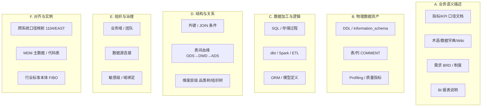
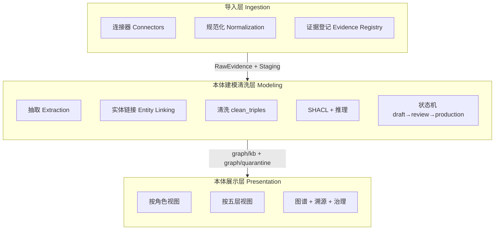
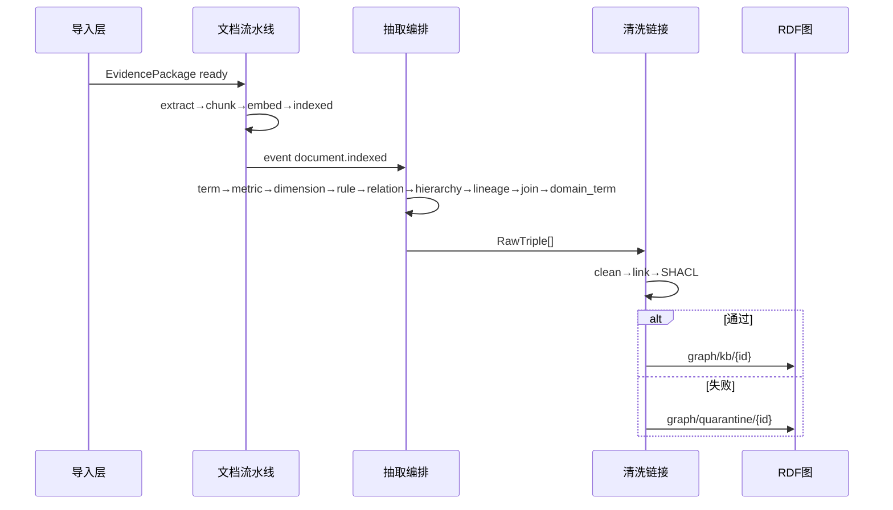
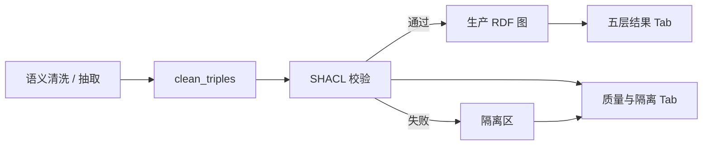
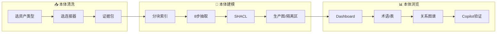

# 本体三层架构与 UI 优化方案

> 本文档汇总 2026-05 关于「企业数据统一整理、本体建模清洗、导入/展示层 redesign」的讨论结论。  
> **关联文档：** [ONTOLOGY_ENTERPRISE_DATA_SOURCES](./企业数据来源与自动化抽取.md)、[ONTOLOGY_REFACTOR_PLAN](./本体驱动重构方案.md)、[DATALENS_OVERVIEW](../项目总览/DataLens项目全貌.md)

**状态说明：** 🔲 规划中 / 🚧 部分已有基础 / ✅ 已实现

**实施进度（2026-05-29）：** 本文档 **P0–P3 已全部落地**；§7 对照表除 §9 能力边界外均为 ✅。展示层已演进为**业务域五层语义资产浏览**（`DomainFiveLayerBrowse`）。剩余待办见 **§11 待办清单**。

---

## 1. 背景与问题

### 1.1 现状

当前知识库「导入」按 **接入通道** 分类（文件 / 官方 API / Git / 数据库），而本体清洗按 **语义角色** 分类（术语、指标、物理表、血缘等）。两套分类轴不一致，导致：

- 用户不清楚「导进来会变成术语还是血缘」；
- `KnowledgeEntry`、`Document`、`TableMeta` 等多处落点，缺少统一的「证据」抽象；
- 本体工作台、知识库详情、`/ontology/[layerKey]` 多入口，认知负担大。

### 1.2 目标

1. **统一整理企业数据** — 按语义资产类型归类，而非按文件/API/Git 归类；
2. **本体驱动清洗** — 唯一写入 production RDF 的路径：`抽取 → 链接 → SHACL → 晋升`；
3. **分层 UI** — 导入层（证据）、清洗层（建模流水线）、展示层（业务视图）。

### 1.3 设计原则（与现有架构一致）

| 原则 | 说明 |
|------|------|
| RDF 为真相源 | `graph/kb/{id}` 为 ABox SSOT，PostgreSQL 为缓存/检索 |
| TBox / ABox 分离 | 模式在 `ontology/tbox/`，实例在知识库图 |
| SHACL 守门 | 通过 → production；失败 → `graph/quarantine/{id}` |
| 采集通道 ≠ 语义分类 | 文件/Notion/Git 只是 **连接器**，顶层按企业数据语义分 |

---

## 2. 企业中常见的数据类型

按 **语义角色** 归纳（与接入渠道无关）：



| 类别 | 典型载体 | 在企业里的作用 |
|------|----------|----------------|
| **A. 业务语义描述** | Word/PDF/飞书/Confluence/制度 | 定义「叫什么、算什么、什么意思」 |
| **B. 物理数据资产** | 各库元数据、数据目录 | 定义「数据在哪、长什么样」 |
| **C. 数据加工逻辑** | Git 内 SQL/dbt/Python | 定义「怎么算出来、从哪张表来」 |
| **D. 结构与关系** | ER 图、JOIN 文档、血缘平台 | 定义「表怎么连、数据怎么流」 |
| **E. 组织与治理** | 域划分、Owner、数据源配置 | 定义「谁管、属哪个域」 |
| **F. 对齐与实例** | 监管映射表、MDM、枚举字典 | 定义「跨系统是否同一概念」 |

**隐性本体：** 外键→对象属性、CHECK→值域、聚合 SQL→指标公式、枚举注释→枚举类 — 多藏在 B/C/D 中，需抽取而非从零建模。

---

## 3. 企业数据 → 本体模块映射

### 3.1 TBox 类与清洗五层

本体 TBox 见 `backend/ontology/tbox/core.ttl`；清洗五层见 [ONTOLOGY_REFACTOR_PLAN](./本体驱动重构方案.md#本体清洗五层模型)。

| 企业数据 | 本体模块（OWL 类 / 属性） | 清洗层 | 抽取器 / 来源 |
|---------|---------------------------|--------|---------------|
| 术语、字段释义、同义词 | `dl:BusinessTerm` | 词汇层 | `term_extractor` |
| KPI、口径、计算公式 | `dl:Metric` | 规则层 | `metric_extractor` |
| 分析维度、下钻层级 | `dl:Dimension` | 实体/概念层 | `dimension_extractor` |
| 校验/派生/风控规则 | `dl:BusinessRule` | 规则层 | `rule_extractor` |
| 概念上下位、产品树 | `skos:broader` / `skos:narrower` | 实体/概念层 | `hierarchy_builder` |
| 概念依赖、指标派生 | `dl:dependsOn`、`dl:derivedFrom`、`skos:related` | 关系层 | `relation_extractor` |
| 库表、列、COMMENT | `dl:PhysicalTable` / `dl:PhysicalColumn` | 数据资产 + 属性层 | 表分析 + `ontology_population`；建 DS 时 `metadata_ingest` |
| 数据源实例 | `dl:DataSource` | 治理 | `/api/datasources` |
| 表间 JOIN | `dl:JoinRelation`、`dl:joinableWith` | 关系层 | `join_extractor`、代码 JOIN 模式 |
| ETL/SQL 表级血缘 | `dl:LineageAssertion`、`dl:transformsFrom` | 关系层 | `lineage_extractor`（Git） |
| 原始材料 | `dl:Document` / `dl:DocumentChunk` | 证据层 | 文档流水线；`dl:groundedBy` 溯源 |
| 跨域/监管对齐 | `skos:exactMatch` / `skos:closeMatch` | 企业层 | `enterprise.ttl`；多需人工或 TTL 导入 |
| 组织/业务域 | `dl:BusinessDomain`、`dl:Organization` | 企业层 | 业务域 UI |
| SHACL 失败项 | `dl:QuarantinedAssertion` | 隔离区 | `clean_triples` → quarantine |

**术语 vs 指标：**

- **BusinessTerm** — 「叫什么、指什么」（词汇层）
- **Metric** — 「怎么算、口径是什么」（规则层，需 `formula` + `caliber`）

### 3.2 当前采集通道 → 语义类型（对照表）

| 采集通道（现状 UI） | 承载的企业数据 | 清洗后主要进入 |
|--------------------|----------------|---------------|
| 文件 / Notion / Confluence / 飞书 | A 类 业务语义 | Term / Metric / Dimension / Rule / Relation / Hierarchy |
| Git 仓库 | C 类 加工逻辑 + 部分 A 类 | Lineage、Join、`mapsToColumn`；少量 Term |
| 数据源 + 表分析 | B 类 物理资产 | PhysicalTable/Column |
| 知识库「数据库导入」 | B 类 引用 | 关联已有 TableMeta，不重复采集 Schema |
| 手动条目 | 任意（质量参差） | 同文档流水线 → 抽取 |
| TTL 本体导入 | 已结构化 RDF | `POST .../ontology/knowledge-bases/{id}/import` |

### 3.3 建议的统一产品分类（四类语义资产 + 治理）

| 统一分类 | 包含的企业数据 | 本体落点 | 服务的 Copilot 能力 |
|---------|---------------|----------|---------------------|
| **1. 业务语义** | 术语、指标、维度、规则、概念层级 | `BusinessConcept` 子类 + SKOS | 术语对齐、口径解释 |
| **2. 物理资产** | 表、列、视图、数据源 | `DataAsset` 子类 | 表路由、SQL 生成 |
| **3. 数据关系** | JOIN、血缘、派生链 | `JoinRelation`、`LineageAssertion` | 多表 JOIN、血缘追溯 |
| **4. 知识证据** | 文档、代码片段、分块 | `Document`/`DocumentChunk` + `groundedBy` | 可观测、溯源 |
| **5. 治理上下文** | 业务域、组织、对齐映射 | `BusinessDomain`、SKOS match | 按域过滤、跨域对齐 |

---

## 4. 三层架构设计

### 4.1 总览



| 层级 | 职责 | 不做什么 |
|------|------|----------|
| **导入层** | 接入、规范化、登记证据包 | 不写 BusinessTerm/Metric 到 production |
| **清洗层** | 抽取、链接、SHACL、晋升、推理 | 不替代 SSOT 的直接 Fuseki 写入（须经 Writer） |
| **展示层** | 业务/治理/专家视图，只读 RDF + 治理操作 | 不维护平行于 RDF 的第二套业务模型 |

### 4.2 导入层（Ingestion）

#### 双轴分类

- **纵轴（用户首选）：** 语义资产类型 — 业务语义 / 物理 Schema / 加工逻辑 / 关系血缘 / 治理上下文 / TTL 包
- **横轴（高级）：** 连接器 — file、notion、confluence、feishu、git、datasource、manual、ttl

#### 核心抽象：EvidencePackage（证据包）

```
EvidencePackage {
  id, kb_id,
  asset_kind:     semantic_doc | physical_schema | processing_code | governance | ttl_bundle
  connector:      file | notion | confluence | feishu | git | datasource | manual | ttl
  source_ref:     { uri, version, checksum, object_id, ... }
  raw_location:   blob_path | git_sha | table_meta_ids[]
  processing_state: registered → normalized → ready_for_extraction
  linked_document_id?, linked_entry_ids[]
}
```

导入层三步：**接入 → 规范化 → 登记**。

#### 建议 API（收敛现有分散路由）

```
POST /api/knowledge-bases/{id}/ingestion/packages   # ✅
POST /api/knowledge-bases/{id}/ingestion/packages/{id}/normalize  # ✅
GET  /api/knowledge-bases/{id}/ingestion/packages   # ✅（DB + 合成视图）
```

现有 `import-file`、`api-sources/import`、`database-imports` 保留为 connector 实现；**file / API / database-import 已接线** `register_evidence_from_import`（✅）。Git / manual / TTL 仍走 ImportPicker 登记或合成视图。

#### 物理资产统一策略

| 场景 | 导入层行为 | 状态 |
|------|-----------|------|
| 新建数据源 | 自动 `EvidencePackage(physical_schema)` + `{ds} 元数据` 知识库 | 🔲 |
| KB「数据库导入」 | 证据包 **引用** 已有 TableMeta | ✅ |
| 表分析完成 | 事件 `schema.analyzed` → population | ✅ |

**规划目录：** `backend/services/ingestion/` — ✅ `evidence.py`、`registry.py`、`events.py`、`connectors.py`；连接器映射表已收敛，各 router 仍保留原实现并可通过 `register_evidence_from_import` 登记。

### 4.3 本体建模清洗层（Modeling）

#### 流水线三段



**阶段 A — 结构化（非 LLM）：** 文档 → DocumentChunk；Schema → PhysicalTable/Column；代码 → 预过滤。

**阶段 B — 语义抽取（LLM，固定顺序）：** ✅ `extraction/orchestrator.py` 已实现 8 步：

1. term → 2. metric → 3. dimension → 4. rule → 5. relation → 6. hierarchy → 7. lineage → 8. join → 9. domain_term

**阶段 C — 清洗晋升：** `clean_triples` → SHACL → production / quarantine；`dl:approvalStatus` + 晋升 API 已可用（✅）；细粒度状态机 `draft → linked → shacl_passed → production` 仍为 🔲 增强项。

#### 实体链接优先级

1. `platformId` 精确匹配 `TableMeta.id`
2. `database.table` 全名
3. 向量相似度（表摘要/列名）
4. 失败 → quarantine（`UNRESOLVED_PHYSICAL_REF`）

#### 建议建模 API

```
GET  /api/ontology/knowledge-bases/{id}/modeling/status          # ✅
GET  /api/ontology/knowledge-bases/{id}/modeling/layers/{key}  # ✅
POST /api/ontology/knowledge-bases/{id}/modeling/runs            # ✅
POST /api/ontology/knowledge-bases/{id}/assertions/promote      # ✅ P2
```

#### 事件驱动（减少散乱 background trigger）

| 事件 | 触发 | 状态 |
|------|------|------|
| `evidence.normalized` | 规范化 API → 语义/代码类证据包触发抽取 | ✅ |
| `document.indexed` | 抽取 orchestrator（后台 8 步） | ✅ |
| `schema.analyzed` | `sync_physical_table_to_ontology` + 可选重跑抽取 | ✅ |
| `git.sync.completed` | lineage + join 抽取（经 orchestrator） | ✅ |
| `assertion.promoted` | 推理图刷新 `materialize_inferred_closure` | ✅ |

### 4.4 本体展示层（Presentation）

#### 信息架构：建模在 KB 内，浏览按业务域

```
/ontology                              # ✅ 语义资产（侧栏当前业务域）
├── 五层芯片浏览                        # ✅ entity-concept → relation → rule → attribute → vocabulary
├── 单层明细分页 + 来源追溯              # ✅ origin: 知识库 + 导入来源
└── 实体概念层：列表 / 树形 / 维度子视图   # ✅ ConceptHierarchyPanel

/knowledge-bases/{id}#modeling          # ✅ 建模与质量（流水线 / 五层结果 / 质量与隔离）
```

**与旧版差异（2026-05-29）：** 原 `OntologyWorkspace` 多 Tab（总览 / 业务语义 / 数据资产 / 关系图谱 / 专家）已收敛为**域级五层浏览**；图谱 / 物理表 / 总览等只读 API 仍保留于 `GET /api/business-domains/{id}/ontology/*`，前端后续可再接。`OntologyWorkspace.tsx` 已标记 `@deprecated`。

#### 场景入口（替代原「角色默认视图」）

原线框中的「业务人员 / 数据治理 / 本体工程师」切换**已移除**（仅跳转 Tab、不隐藏内容，易造成冗余导航）。改为 **URL + Tab** 区分场景：

| 场景 | 入口 | 默认视图 |
|------|------|----------|
| 只读浏览已入图资产 | 侧栏「语义资产」→ `/ontology` | 五层芯片（默认 `entity-concept`） |
| 建模进度与治理 | 知识库详情 `#modeling`「建模与质量」区块 | 流水线 / 五层结果 / 质量与隔离（见 §5.3.1） |
| 按知识库筛选 | `/ontology?kb={id}` | 同上，仅展示该 KB 贡献的资产 |
| 深链到指定层 | `/ontology?layer=vocabulary` | 选中对应五层芯片 |

遗留路由：`/business-domains/{id}/ontology` → `/ontology`（保留 query）；`/knowledge-bases/{id}/ontology` → `/ontology?kb={id}`；`?tab=governance` → `/knowledge-bases/{id}#modeling`。

#### 展示层原则

| # | 原则 | 状态 |
|---|------|------|
| 1 | 默认总览；专家 Tab 置末并附说明 | ✅ |
| 2 | 详情页 **溯源链**：`groundedBy → DocumentChunk → EvidencePackage` | ✅ |
| 3 | 列表/树/图来自 **同一 SPARQL**，避免前端双份状态 | ✅（术语/指标/维度/规则/图谱/层级） |
| 4 | 写操作经 `OntologyWriter`，不直写 Fuseki | ✅ |

#### 建议只读 View API

```
GET /api/ontology/knowledge-bases/{id}/views/overview    # ✅
GET /api/ontology/knowledge-bases/{id}/views/terms       # ✅
GET /api/ontology/knowledge-bases/{id}/views/graph     # ✅
GET /api/ontology/knowledge-bases/{id}/views/lineage   # ✅
GET /api/ontology/knowledge-bases/{id}/views/hierarchy # ✅
GET /api/ontology/knowledge-bases/{id}/views/triples   # ✅
GET /api/ontology/knowledge-bases/{id}/dimensions      # ✅
GET /api/ontology/knowledge-bases/{id}/rules           # ✅
GET /api/ontology/knowledge-bases/{id}/provenance      # ✅
```

#### 与 Copilot 闭环

Metric/Table 详情提供「Copilot 验证」→ 根据 `routing_trace` 回流修正 quarantine。（🔲 未实现）

---

## 5. UI 线框图示

> 线框与实现对照：**✅ 已落地** / **🔲 部分或未实现**

### 5.1 全局导航 ✅（部分）

| 线框项 | 实现 |
|--------|------|
| 📥 本体清洗 | ✅ AppShell → `/knowledge-bases`；KB 详情含「建模与质量」 |
| 📊 语义资产 | ✅ AppShell → `/ontology`（五层浏览；依赖侧栏当前业务域） |
| 🧹 本体建模（逻辑层） | ✅ 仅 KB 详情内进度，不占侧栏 |
| 💬 Copilot / ⚙️ 数据源 | ✅ 原有入口保留 |

### 5.2 导入向导 — 连接器决定资产类型 ✅

`ImportPickerModal.tsx`：**连接器 → 配置**（两步）。证据包由导入 API 自动登记，不再在前端按资产类型拆分登记；语义清洗仍在导入源卡片触发。

### 5.3 知识库详情：导入源 + 证据包登记 ✅

**页面：** `/knowledge-bases/[id]`

#### 导入源卡片（`SourceCardGrid` + `SourceCard.tsx`）

- 展示 Git、文件/API 条目、**手动条目**、数据库导入等可操作源。
- **统一入口「语义清洗」**：`POST /api/knowledge-bases/{id}/sources/{source_id}/clean?source_type=...`，后台走 9 步抽取流水线（与 `trigger_semantic_pipeline_background` → `run_extraction_pipeline` 同源）。
- 本体工作台「运行完整建模」（`POST .../modeling/runs`）仍保留**知识库级**入口；证据包列表**不再**提供行级「规范化 / 触发建模」。

#### 证据包列表（`EvidencePackageList.tsx`）

只读**溯源与进度**视图（写入 RDF 前不作操作入口）。列定义（2026-05）：

| 列 | 说明 |
|----|------|
| 证据包 | `EP-xxxx` 展示 ID |
| 标题 | 证据标题（第 2 列） |
| 类型 | 连接器 **图标**（悬停 tooltip：连接器中文名）+ 资产类型文字（由连接器推导，仅溯源） |
| 状态 | 合并原「状态 + 下游」；**颜色 chip** 表示导入/建模进度 |
| 登记时间 | `created_at` 本地化显示 |

**状态 chip 配色**（`frontend/lib/themeClasses.ts`）：

| 显示 | 语义 | 样式 |
|------|------|------|
| 已入图、已索引 | 完成 | 绿 `chipSuccess` |
| 抽取中 N% | 进行中 | `chipProgress` |
| 待抽取、已规范化 | 可继续 | `chipInfo` |
| 待规范化、待索引 | 待处理 | `chipWarning` |
| 已登记 | 初始 | `chipNeutral` |
| 抽取失败 | 失败 | `chipError` |

数据：`GET .../ingestion/packages`（DB 持久化 + 合成视图）；建模进度 `GET .../ontology/knowledge-bases/{id}/modeling/status`（列表轮询）。

登记：各导入 API 完成后由后端 `register_evidence_from_import` 自动登记（按连接器一次一条，不按资产类型拆分）；`POST .../packages/{id}/normalize` 仍可用于手动推进规范化。

#### 5.3.1 建模与质量：子 Tab 说明 ✅

**入口：** `/knowledge-bases/{id}#modeling`（组件 `KbModelingQualitySection.tsx`）

「建模与质量」拆为三个子 Tab，避免流水线、五层明细、SHACL/隔离区挤在同一屏。深链示例：

| Hash / URL | 作用 |
|------------|------|
| `#modeling` | 默认进入「五层结果」（有数据时）或「流水线」 |
| `#modeling?tab=pipeline` | 9 步抽取进度 |
| `#modeling?tab=layers&layer=vocabulary` | 五层结果 + 选中词汇层 |
| `#modeling?tab=quality` | 质量与隔离（默认子 Tab：有隔离→待办，否则→指标） |
| `#modeling?tab=quality&quality=todo` | 质量 → 待办（隔离区） |
| `#modeling?tab=quality&quality=metrics` | 质量 → 指标（SHACL + 置信度） |
| `#quarantine` / `#modeling?tab=quality&quality=todo&quarantine=1` | 质量 → 待办并滚动到隔离区 |
| `/knowledge-bases/{id}/ontology/{layerKey}` | 重定向到 `#modeling?tab=layers&layer=…` |

**在清洗流水线中的位置：**



- **五层结果**：查看**已写入生产图**、并按语义层分类的实例（「库里有什么」）。
- **质量与隔离**：查看**校验与治理**状态，以及**未入生产图、待处理**的断言（「质量如何、要不要人工处理」）。

---

##### Tab 1：流水线

| 内容 | 说明 |
|------|------|
| 9 步抽取进度 | 术语 / 指标 / 维度 / 规则 / 关系 / 层级 / 血缘 / JOIN 等步骤状态 |
| 运行完整建模 | `POST .../modeling/runs`，知识库级触发，与导入源「语义清洗」同源编排 |

数据：`GET .../modeling/status`。

---

##### Tab 2：五层结果

**展示结构**

1. **五层芯片（摘要）** — 每层仅显示图标、层名、条数；不一次加载全部明细。
2. **选中层明细** — 仅当前层：`GET .../modeling/layers/{layer_key}?limit=50&offset=…`（懒加载 + 分页 + 当前页搜索）。
3. **上次清洗时间** — 来自 `ontology-cleaning-results` 的 `last_cleaning_at`（若有）。

摘要接口：`GET .../ontology-cleaning-results`（默认**不含** `items`；`?include_items=true` 可恢复全量，一般仅兼容用）。

**芯片顺序（产品五层）**

`vocabulary` → `rule` → `entity-concept` → `relation` → `attribute`

**各层含义与明细列**

| 层 | RDF 类型 / 含义 | 明细表格列 |
|----|-----------------|------------|
| 词汇层 | `dl:BusinessTerm` 业务术语 | 名称、定义、状态、IRI |
| 规则层 | `dl:Metric`、`dl:BusinessRule` 指标与规则 | 名称、公式、口径/表达式、状态 |
| 实体概念层 | `dl:BusinessConcept` 概念层级 | 名称、上位概念、IRI |
| 关系层 | 语义边（dependsOn、derivedFrom、joinableWith、skos:related 等） | 主体、谓词、客体 |
| 属性层 | 字面量数据属性三元组 | 主体、属性、值 |

**维度（`dl:Dimension`）** 不在五层芯片中单独占一格：若存在维度数据，在「实体概念层」芯片显示 `+N维` 角标，并可切换 **概念 / 维度** 子视图；维度明细列：名称、定义、维度类型、状态。

**实体概念层视图：** 概念子视图支持 **列表**（分页表格，含 `broader` 列）与 **树形**（懒加载 `GET .../views/hierarchy`，`ConceptHierarchyPanel`）。树形用于核对 `skos:broader` 结构与 hierarchy SHACL；原放在「质量与隔离」中的概念层级已迁至此，避免与隔离待办混在同一屏。

五层模型定义与 SHACL 映射见 [ONTOLOGY_REFACTOR_PLAN § 本体清洗五层模型](./本体驱动重构方案.md#本体清洗五层模型)。

**空态**

- 五层总数均为 0：提示先在导入源上触发「语义清洗」。
- 单层为 0：芯片显示 `0`，明细区「本层暂无数据」。

**不在此 Tab 展示**

- 抽取流水线进度 → 「流水线」Tab  
- SHACL、置信度、隔离区待办 → 「质量与隔离」Tab；概念层级树 → 五层 → 实体概念层 → 树形  
- 导入源卡片上的实体/关系计数 → 页面上方「本体清洗」区域  

---

##### Tab 3：质量与隔离

语义清洗之后的**治理与把关**视图：聚焦**可行动待办**与**汇总指标**，不再纵向堆叠 SHACL + 置信度 + 概念树 + 隔离区。组件：`KbModelingQualityPanel.tsx`。

**展示结构**

1. **顶部 KPI 条**（始终可见）：SHACL 通过率、隔离待办条数、低置信（&lt;50）数量；点击 KPI 切换到对应子 Tab。
2. **子 Tab「待办」**：仅隔离区列表（`QuarantineList`）。有隔离条目时默认进入此 Tab。
3. **子 Tab「指标」**：SHACL 校验 + 置信度分布。无隔离时默认进入此 Tab。

**为何不再包含「概念层级」？** 概念层级是**已入图概念的结构浏览**（`views/hierarchy`），与隔离待办不是同一类任务，且与五层「实体概念层」表格重复。现迁至 **五层结果 → 实体概念层 → 列表/树形**，与概念数据同屏查看；树形仍用于 hierarchy SHACL 相关的结构核对。

| 区块 | 子 Tab | 作用 |
|------|--------|------|
| KPI 条 | — | 一眼判断通过率、待办量、低置信规模 |
| **隔离区** | 待办 | SHACL 未通过或清洗挡下的三元组（隔离图，非生产图）；批准 / 拒绝 / `apply-fix` |
| **SHACL 校验** | 指标 | 本体 Shape 合规汇总（`modeling/status.shacl_pass_rate`） |
| **置信度分布** | 指标 | 术语+指标 `dl:confidence` 分桶统计 |

**按需加载：** 进入 quality Tab 时请求 `quarantine` + `terms`/`metrics`（KPI 低置信）；`views/hierarchy` 仅在五层实体概念层选「树形」时请求。流水线 Tab 不拉隔离/置信度/层级。

隔离区 API：`GET .../quarantine?limit=20&offset=0`（分页，默认每页 20 条）；处理：`POST .../quarantine/{idx}/resolve`、`POST .../apply-fix`。

**使用场景对照**

| 场景 | 建议先看 |
|------|----------|
| 清洗刚完成，看抽了多少术语/关系 | 五层结果 |
| 清洗完成但 Copilot / 问数异常 | 质量与隔离 → 待办（隔离区）+ KPI 通过率 |
| 术语多但层级混乱 | 五层结果 → 实体概念层 → 树形 |
| AI 抽取大量低置信概念 | 质量与隔离 → 指标（置信度分布） |

**经验法则：** 隔离区为空且 SHACL 通过率高，通常表示本体可作为生产数据使用；五层结果是「已入图资产目录」，质量与隔离是「KPI + 待办/指标」，不再承担概念树浏览。

---

### 5.4 本体建模总览 ✅

`ModelingPipelineStatus.tsx` + `POST .../modeling/runs`「运行完整建模」；五层摘要见 `GET .../ontology-cleaning-results`，单层明细分页见 `GET .../modeling/layers/{layer_key}`（`OntologyLayerDetailPanel.tsx`）。

### 5.5 语义资产 — 业务域五层浏览 ✅

**页面：** `/ontology`（`DomainOntologyPageShell` → `DomainFiveLayerBrowse`）

按**侧栏当前业务域**聚合绑定知识库的已入图五层资产；`?kb=` 为可选知识库筛选器。

| 能力 | 实现 |
|------|------|
| 五层芯片摘要 | `GET /api/business-domains/{id}/ontology/layers` |
| 单层明细分页 | `GET .../ontology/layers/{layer_key}?limit&offset` |
| 来源追溯列 | `origin.knowledge_base_name` + `origin.source_label`（`groundedBy` → Document） |
| 行级溯源详情 | `GET /api/ontology/knowledge-bases/{kb}/provenance?subject=` |
| 实体概念层树形 | `ConceptHierarchyPanel`（`views/hierarchy`，按 KB） |
| 维度子视图 | 实体概念层芯片 `+N维` 角标；`?layer=dimension` 或 `?entity=dimension` |

**五层芯片顺序（语义资产浏览）：** `entity-concept` → `relation` → `rule` → `attribute` → `vocabulary`（与 KB 内「建模与质量 → 五层结果」的 `vocabulary` 优先顺序不同，见 §5.3.1）。

**后端聚合：** `backend/services/ontology/domain_aggregation.py` + `routers/domain_ontology.py`。

**域级只读 API（已实现，前端图谱 Tab 待接）：** `overview`、`terms`、`metrics`、`graph`、`lineage`、`assets` — 均支持 `?kb=` 筛选。

### 5.6 用户旅程 ✅（除 Copilot 验证）

导入 → 建模 → 浏览主路径已通；**Copilot 验证**（C4）仍为 🔲。

---

#### 线框原文（归档）

**5.1 全局导航**

```
┌─────────────────────────────────────────────────────────────────────────────┐
│ DataLens    [知识库 ▼ 财务域知识库]              🔔  帮助  用户              │
├──────────────┬──────────────────────────────────────────────────────────────┤
│  📥 本体清洗  │   ← 导入层：证据包、连接器、接入进度                            │
│  🧹 本体建模  │   ← 清洗层：抽取流水线、五层结果、隔离区                        │
│  📊 本体浏览  │   ← 展示层：术语/指标/表/图谱（业务主视图）                    │
│  💬 Copilot  │                                                              │
│  ⚙️ 数据源   │   （全局：物理连接）                                            │
└──────────────┴──────────────────────────────────────────────────────────────┘
```

**5.2 导入向导 — 连接器决定资产类型**

```
┌─────────────────────────────────────────────────────────────────────────────┐
│  本体清洗  ›  新建接入                                              [关闭 ×] │
├─────────────────────────────────────────────────────────────────────────────┤
│  ① 连接器    ② 配置                                                         │
│  ●────────────○                                                             │
├─────────────────────────────────────────────────────────────────────────────┤
│  选择接入连接器（卡片副标题展示该连接器对应的资产类型）：                        │
│  ┌──────────────┐ ┌──────────────┐ ┌──────────────┐                         │
│  │ 文件上传      │ │ 代码库同步    │ │ 数据源引用    │  …                       │
│  │ 业务语义、血缘 │ │ 加工逻辑、血缘 │ │ 物理 Schema  │                         │
│  └──────────────┘ └──────────────┘ └──────────────┘                         │
│                              [ 取消 ]              [ 进入配置 → ]            │
└─────────────────────────────────────────────────────────────────────────────┘
```

**5.3 证据包列表（只读进度 + 导入源卡片操作）**

```
┌─────────────────────────────────────────────────────────────────────────────┐
│  财务域知识库                            [ 建模与质量 ] [ 设置 ] [ 本体清洗 ] │
├─────────────────────────────────────────────────────────────────────────────┤
│  导入源（3）                                                    [ 刷新 ]     │
│  ┌─────────────┐ ┌─────────────┐ ┌─────────────┐                            │
│  │ Git · main  │ │ 📄 制度.pdf │ │ 🗄 订单库   │                            │
│  │ [同步][清洗]│ │ [语义清洗]  │ │ [语义清洗]  │   ← 统一在此触发建模流水线   │
│  └─────────────┘ └─────────────┘ └─────────────┘                            │
├─────────────────────────────────────────────────────────────────────────────┤
│  证据包登记（溯源视图，无行级操作）                                            │
├──────────┬────────────────────┬──────────────────┬────────────┬──────────────┤
│ 证据包    │ 标题              │ 类型              │ 状态        │ 登记时间      │
├──────────┼────────────────────┼──────────────────┼────────────┼──────────────┤
│ EP-1042  │ 订单域指标说明     │ [📄] 业务语义     │ ● 抽取中62% │ 2026-05-10 … │
│ EP-1038  │ prod_dw · orders   │ [🗄] 物理 Schema  │ ● 待抽取    │ 2026-05-09 … │
└──────────┴────────────────────┴──────────────────┴────────────┴──────────────┘
  类型列：[图标]=连接器（悬停显示「文件上传」等）；右侧为资产类型中文名。
  状态列：合并导入状态与建模下游；颜色 chip（绿/蓝/黄/灰/红）。
```

**5.4 本体建模总览**

```
┌─────────────────────────────────────────────────────────────────────────────┐
│  本体建模  ›  财务域知识库                         [ 运行完整建模 ]           │
├─────────────────────────────────────────────────────────────────────────────┤
│  证据包 EP-1042 ──► 分块索引 ✓ ──► 抽取 ████████░░ 62% ──► 清洗 ○ ──► 入图 ○  │
│  ┌─────────┐ ┌─────────┐ ┌─────────┐ ┌─────────┐                           │
│  │ Term 128│ │ 表链接78%│ │ SHACL91%│ │ 隔离区14│                           │
│  └─────────┘ └─────────┘ └─────────┘ └─────────┘                           │
│  五层: [词汇层 128] [规则层 52] [实体层 34] [关系层 89] [属性层 1.2k]         │
│  步骤: term✓ metric✓ dimension○ rule○ relation○ hierarchy○ lineage○ join○  │
└─────────────────────────────────────────────────────────────────────────────┘
```

**5.5 本体浏览 — 关系图谱 Tab**

```
┌─────────────────────────────────────────────────────────────────────────────┐
│  [ 总览 ] [ 业务语义 ] [ 数据资产 ] [● 关系图谱 ] [ 清洗治理 ] [ 专家 ]        │
│  图层: ☑术语/指标  ☑物理表  ☑JOIN  ☑血缘                                      │
│      ┌─────────┐  derivedFrom   ┌─────────┐                                 │
│      │  日GMV   │ ─────────────► │   GMV    │                                 │
│      └────┬────┘                └────┬────┘                                 │
│           │ computedFrom              │ mapsToColumn                        │
│           ▼                           ▼                                     │
│      ┌─────────┐  joinableWith  ┌──────────────┐                            │
│      │ orders  │◄──────────────►│  customers   │                            │
│      └────┬────┘                └──────────────┘                            │
│           │ transformsFrom → dwd_orders                                     │
└─────────────────────────────────────────────────────────────────────────────┘
```

**5.6 用户旅程**



---

## 6. 三层契约

| 从 → 到 | 契约 |
|---------|------|
| 导入 → 清洗 | `EvidencePackage.id` + `Document.status=indexed` 事件 |
| 清洗 → RDF | 仅 `OntologyWriter` / `persist_clean_result` |
| RDF → 展示 | 只读 SPARQL views + `graph/kb` + `graph/inferred` |
| 展示 → 清洗 | `promote` / `quarantine/resolve` → 重新 `clean_triples` |
| 清洗 → PG | 异步缓存（检索、Copilot），**非 SSOT** |

---

## 7. 与现有实现对照

| 能力 | 状态 | 代码/入口 |
|------|------|-----------|
| 语义资产类型导入向导（P0） | ✅ | `ImportPickerModal.tsx`（连接器 → 配置；资产类型自动映射） |
| 证据包列表（溯源 + 彩色状态） | ✅ | `EvidencePackageList.tsx`、`GET .../ingestion/packages`、`modeling/status` |
| 导入源卡片 + 统一语义清洗 | ✅ | `SourceCardGrid.tsx`；含手动条目；`POST .../sources/{id}/clean` |
| 文档流水线 | ✅ | `knowledge_pipeline_service` |
| 9 步抽取编排 | ✅ | `services/extraction/orchestrator.py` |
| clean_triples + SHACL | ✅ | `ontology_triple_cleaner.py`、`ontology/validator.py` |
| 五层清洗结果 API（摘要 + 分页明细） | ✅ | `GET .../ontology-cleaning-results`（默认无 items）；`GET .../modeling/layers/{key}?limit&offset` |
| 隔离区 API | ✅ | `quarantine.py`、`QuarantineList.tsx` |
| 统一语义资产浏览（域级五层） | ✅ | `DomainFiveLayerBrowse.tsx`、`/ontology`；`domain_ontology.py` |
| KB 建模与质量区块（三子 Tab） | ✅ | `KbModelingQualitySection.tsx`；质量内 `KbModelingQualityPanel`（KPI + 待办/指标）；§5.3.1 |
| 实体概念层列表/树形 | ✅ | 五层浏览 + `ConceptHierarchyPanel`；KB 内 `OntologyCleanResultCards` |
| 建模流水线 status API（P0） | ✅ | `GET .../modeling/status`、`ModelingPipelineStatus.tsx` |
| `services/ingestion/` | ✅ | `registry.py` + `events.py` + `connectors.py` |
| 证据包 DB + POST/normalize | ✅ | `EvidencePackage` 模型、`knowledge_ingestion.py` |
| 隔离区模板修复 | ✅ | `quarantine_templates.py`、`apply-fix` API、`QuarantineList` |
| 专家 SPARQL / 三元组 | ✅ | `SparqlConsole`、`views/triples`（KB 建模区块内，非全局 Tab） |
| 事件 `document.indexed` → 抽取 | ✅ | `events.py` → `trigger_extraction_pipeline_background` |
| SPARQL view API（P2） | ✅ | `services/ontology/views.py` |
| assertion 晋升（P2） | ✅ | `assertion_lifecycle.py`、`POST/GET .../assertions/*` |
| modeling/layers + modeling/runs | ✅ | `modeling_layers.py`；`modeling/runs` 在 KB 建模区块；列表无行级触发 |
| 维度/规则展示 API + Tab | ✅ | `GET .../dimensions`、`GET .../rules` |
| 场景入口（浏览 + KB 内建模） | ✅ | 侧栏「语义资产」；建模在 KB `#modeling` |
| 溯源链 API + 详情 | ✅ | `GET .../provenance`、`EntityDetailPanel`、五层行级溯源面板 |
| 关系图谱 / 物理表域级 API | ✅ | `domain_graph` / `domain_assets`；前端图谱 UI 🔲 |
| 概念层级树 | ✅ | `views/hierarchy` + 五层实体概念层树形 |
| 全局导航「本体清洗」 | ✅ | AppShell 侧栏 |
| 事件 schema/git/promote | ✅ | `events.py` + analyze/git/promote 发射 |
| 连接器登记接线 | ✅ | file / API / database-import 路由 |
| 证据包合并状态列（颜色 chip） | ✅ | `EvidencePackageList` + `themeClasses` chip；原「下游」列已合并 |
| 数据源删除级联清理 | ✅ | `datasource_cleanup.py`；`DELETE /api/datasources/{id}` |
| 旧 OntologyWorkspace 多 Tab | ✅ 已收敛 | 由 `DomainFiveLayerBrowse` 替代；`OntologyWorkspace.tsx` deprecated |
| MDM / 组织抽取 | 🔲 | TBox 有类，抽取弱（规划预期，见 §9） |
| Copilot 验证闭环 | 🔲 | Metric/Table 详情 → quarantine 回流 |
| 独立「本体建模」侧栏入口 | ✅ 已取消 | 建模进度仅在 KB 详情 |
| 新建数据源自动证据包 | 🔲 | 见 §4.2 物理资产策略 |
| 细粒度断言状态机 | 🔲 | `linked` / `shacl_passed` 独立阶段 |
| 事件驱动 ingestion | ✅ | 全事件总线见 §4.3 |

---

## 8. 演进优先级

| 优先级 | 项 | 状态 | 说明 |
|--------|-----|------|------|
| **P0** | 导入向导改为「连接器决定资产类型」 | ✅ | `ImportPickerModal.tsx` |
| **P0** | `modeling/status` + 流水线进度 UI | ✅ | `modeling_status.py`、`ModelingPipelineStatus.tsx` |
| **P1** | `EvidencePackage` + ingestion 服务 | ✅ | DB + POST/normalize + 导入向导登记 |
| **P1** | 合并本体工作台入口 | ✅ | `/ontology`（域级）+ KB `#modeling`；遗留 KB/域 ontology 路由重定向 |
| **P2** | SPARQL view API | ✅ | `views.py`；域级 graph/lineage 在 `domain_aggregation.py` |
| **P2** | assertion 状态机 + quarantine 修复 | ✅ | 晋升 API + 模板 `apply-fix` |
| **P3** | ingestion 收敛、事件驱动 | ✅ | `connectors.py` + 事件总线；建模由导入源「语义清洗」统一触发 |

---

## 9. 能力边界（规划预期）

| 企业数据 | 成熟度 | 备注 |
|---------|--------|------|
| 文档 → 术语/指标/关系 | 高 | 主流路径 |
| Schema → 物理表/列 | 高 | 依赖表分析 |
| 代码 → 血缘 | 中 | 依赖 Git + LLM |
| MDM 实例（ABox） | 低 | 偏未来 |
| 组织/团队自动抽取 | 低 | 多人工 |
| 监管/行业标准对齐 | 低 | TTL 或人工 |

---

## 10. 附录：当前支持的文件与连接器

### 文档上传

扩展名：`.md`、`.txt`、`.html`、`.docx`、`.pdf`、`.xlsx`、`.csv`；单文件 ≤ 12MB。  
实现：`backend/services/knowledge_ingest.py` → `ALLOWED_EXTENSIONS`。

### 官方 API

`notion` | `confluence` | `feishu` — `backend/routers/knowledge_api_sources.py`。

### Git

`github` | `gitlab`；默认 glob：`*.sql,*.py,*.yml,*.yaml,*.hql`（新建源；已有源不强制迁移）。

Git 语义清洗（路径 B）支持多语言规则抽取：Python pandas/PySpark、dbt YAML、Java @Select 等；失败时在流水线步骤写入 `_git_diagnostics`（扩展名分布、规则命中、单表引用计数等），证据包列表可折叠查看。

### 数据源类型（13 种）

`mysql`、`mariadb`、`doris`、`starrocks`、`postgres`/`postgresql`、`greenplum`、`sqlserver`、`sqlite`、`clickhouse`、`trino`、`hive` — `schema_extractor.ALLOWED_SOURCE_TYPES`。

---

## 11. 待办清单（未办 / 部分）

| 项 | 优先级 | 状态 | 说明 |
|----|--------|------|------|
| 域级关系图谱 / 物理表前端 Tab | 中 | 🔲 | API 已有（`domain_graph` / `domain_assets`）；`RelationGraph` 组件待接回 `/ontology` |
| MDM / 组织自动抽取 | 低 | 🔲 | §9 能力边界，偏未来 |
| Copilot 验证 → quarantine 回流 | 中 | 🔲 | §4.4 闭环 |
| 独立「本体建模」全局导航 | 低 | 🔲 | §5.1 三线框第三入口 |
| 新建数据源自动 EvidencePackage | 低 | 🔲 | §4.2 |
| 断言细粒度状态机 | 低 | 🔲 | `linked` / `shacl_passed` 独立于 approvalStatus |
| Git 导入路由证据包登记 | 低 | 🚧 | Git 同步走事件；创建 git source 时未统一登记 |
| PG 缓存 assertion.promoted 后刷新 | 低 | 🚧 | 推理图已刷新；PG 语义缓存异步更新待补 |

> **说明：** 除上表外，本文档 P0–P3 及 §7 主对照项均已标记 ✅。

---

*文档版本：2026-05-29（§4.4/§5.5 业务域五层语义资产浏览；`domain_ontology` API；`OntologyWorkspace` 收敛）· 讨论沉淀自知识库导入分类与本体三层 UI 设计会话*
